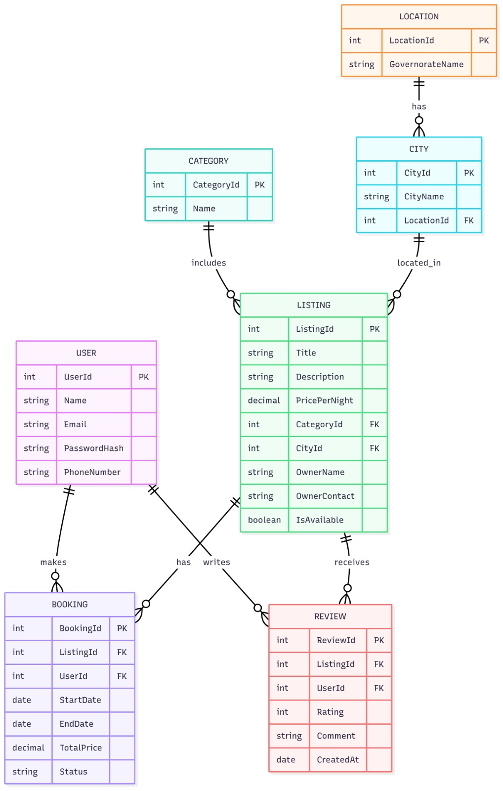

# 🏨 Mabeet - Accommodation & Housing Platform

A modern **Frontend Web Project** built with **HTML, CSS, and JavaScript** to showcase and book accommodations across Egypt.  
This project provides an elegant user interface, interactive forms, and a responsive design suitable for travel and booking websites.

---

## 📸 ERD (Entity Relationship Diagram)


---

## ✨ Features
- **Responsive Design** with **Bootstrap 5**.
- Smooth animations powered by **AOS (Animate On Scroll)**.
- Interactive **Popups & Alerts** using **SweetAlert2**.
- **Date Picker** for check-in/out with **Flatpickr** (Arabic localization).
- **Font Awesome Icons** for modern UI elements.
- **Google Fonts (Cairo)** for a clean Arabic/English typography.
- **Loading Screen** with spinner animation.
- **Parallax Scroll Effect** on hero section.
- **Google Maps Integration** to display locations.
- Sections:  
  - 🏠 **Home** (Hero & Search form)  
  - 🛎️ **Services** (Luxury Hotels, Hostels, Local Stays)  
  - 🌟 **Featured Deals** (Special accommodation offers)  
  - 🎓 **Student Housing** (Affordable student rooms & apartments)  
  - 🗺️ **Map** (Interactive Google Maps integration)  
  - 📞 **Contact & Footer** (About, quick links, customer service, social media)  

---

## 📂 Project Structure
```
mabeet/
│── index.html        # Main HTML file (structure of the website)
│── style.css         # CSS file (design, colors, gradients, layout, responsiveness)
│── script.js         # JavaScript file (interactivity, date pickers, modals, scroll effects)
│── assets/
│     └── erd.jpg     # ERD diagram image
```

---

## 🛠️ Technologies & Libraries Used
- **[Bootstrap 5](https://getbootstrap.com/)** → responsive layout & components  
- **[Font Awesome 6](https://fontawesome.com/)** → icons  
- **[Google Fonts - Cairo](https://fonts.google.com/specimen/Cairo)** → custom font  
- **[AOS (Animate On Scroll)](https://michalsnik.github.io/aos/)** → scroll animations  
- **[SweetAlert2](https://sweetalert2.github.io/)** → modern popups & alerts  
- **Google Maps Embed** → location display  

---

## 📖 Project Explanation

### 1. **HTML (index.html)**
- Contains the main structure of the website:
  - Navigation bar with links to each section.
  - Hero section with background image and search form.
  - Services section with animated service cards.
  - Featured properties with booking buttons.
  - Student housing section with different room types.
  - Google Maps embed for location display.
  - Footer with about, links, and contact information.

### 2. **CSS (style.css)**
- Custom styling for all components:
  - Gradient backgrounds and color schemes.
  - Responsive navbar with hover effects.
  - Hero section with overlay & text shadows.
  - Service, property, and student cards with hover animations.
  - Buttons with gradient styles and hover effects.
  - Loading screen with spinner animation.
  - Responsive adjustments for smaller devices (media queries).

### 3. **JavaScript (script.js)**
- Adds interactivity to the website:
  - **Loading Screen** hides after page load.
  - **AOS** initialized for scroll animations.
  - **Smooth Scroll** for navigation links.
  - **Flatpickr** for check-in and check-out dates.
  - **SweetAlert2** used for:
    - Search form validation & results.
    - Login & Register modals.
    - Booking confirmation for properties.
    - Service details alerts.
  - **Navbar scroll effect** (changes style when scrolled).
  - **Parallax effect** on hero background.

---

## 🚀 How to Run
1. Clone the repository:
   ```bash
   git clone (https://github.com/nouran-Omar/depi/)
   ```
2. Open `index.html` in any modern browser.
3. Done! 🎉

---

## 👩‍💻 Developer
Developed with ❤️ by **Mabeet**
